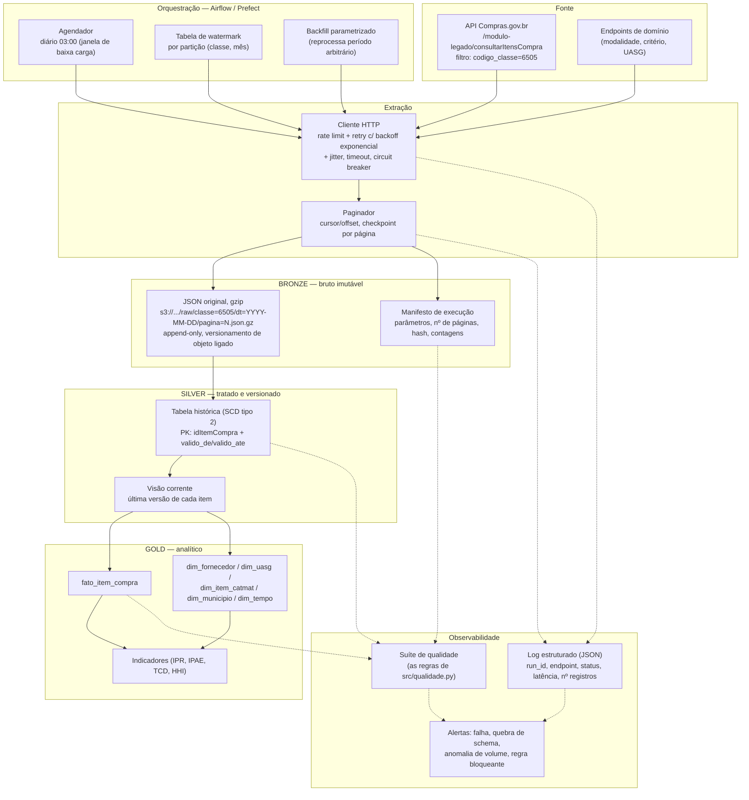

# Etapa 1 — Proposta de coleta automatizada e recorrente

> **Escopo desta proposta.** O enunciado pede uma arquitetura para consumir
> **APIs públicas em geral** — o Compras.gov é o *exemplo* que o case oferece,
> não o alvo exclusivo do desenho. Por isso a arquitetura das §0 a §10 é
> **agnóstica de API**: nenhuma decisão de arquitetura depende de nome de
> endpoint, de parâmetro específico ou de particularidade do Compras.gov.
> Ela resolve as quatro limitações que o enunciado nomeia como típicas de
> qualquer API pública — disponibilidade, desempenho, documentação e mudança
> ao longo do tempo — e serviria, com o mesmo desenho, para consumir o PNCP,
> o Portal da Transparência, a API de dados abertos do IBGE ou qualquer outra
> fonte HTTP paginada e sujeita a instabilidade.
>
> A §11, ao final, é um **anexo**: aplica esse desenho genérico ao exemplo
> concreto fornecido, usando o índice real do Swagger do Compras.gov. Ela
> existe para mostrar que a arquitetura é implementável, não para redefini-la
> em torno de uma API específica — se o exemplo fosse outro, apenas a §11
> mudaria.
>
> Não há implementação executada; `src/coleta.py` traz o esqueleto comentado
> das partes não triviais, também escrito de forma agnóstica (usa `Protocol`
> para cliente HTTP e armazenamento, não uma biblioteca específica).

---

## Em linguagem direta

**O problema.** Os dados vêm de um sistema que **reescreve o passado**: 68%
dos itens são atualizados mais de um ano depois da compra, e encontrei itens
que mudaram de fornecedor e de quantidade depois de registrados. Uma coleta
que só busque "o que é novo" produziria uma base diferente da fonte; uma que
sobrescreva tudo apagaria a evidência de que houve mudança.

**A solução, em cinco frases.**

1. **Guardar primeiro, entender depois.** A resposta da API é salva exatamente
   como chegou, sem nenhuma transformação, num armazenamento que não permite
   alteração posterior. Se uma regra de interpretação estiver errada, corrige-
   se a regra sem precisar coletar quatro anos de dados de novo.
2. **Duas rotinas, não uma.** Uma diária, que busca o que mudou desde a última
   execução; uma mensal, que confere se a contagem local ainda bate com a
   fonte. A primeira é rápida e barata; a segunda pega o que a primeira não
   consegue ver.
3. **Guardar todas as versões.** Quando um item muda, a versão antiga não é
   apagada — fica marcada como encerrada. Assim é possível responder "o que
   essa compra dizia em dezembro de 2024?", pergunta que a base entregue neste
   case não consegue responder.
4. **Falhar alto e cedo.** Se a estrutura dos dados mudar (uma coluna
   desaparecer, um tipo mudar), a coleta **para** e avisa, em vez de continuar
   rodando e gerar números errados em silêncio.
5. **Repetir é seguro.** Toda escrita é idempotente: rodar a mesma coleta duas
   vezes produz o mesmo resultado. É isso que permite recuperar de qualquer
   falha simplesmente tentando de novo.

**Por que isso importa para a organização.** Um indicador publicado é uma
afirmação pública. Se alguém contestar um número daqui a dois anos, essa
arquitetura permite reproduzir exatamente o dado que sustentou aquela
afirmação — inclusive se a fonte já tiver mudado desde então.

---

## Mapa de cobertura do enunciado

Todas as decisões abaixo são **genéricas** — nenhuma depende de qual API está
por trás. O Compras.gov só aparece no anexo final, como exemplo aplicado.

| O que a Etapa 1 pede | Onde está | Decisão em uma linha |
|---|---|---|
| estratégia de coleta e atualização | §2 | duas trilhas: incremental diária por marca d'água + reconciliação mensal |
| paginação e limites de requisição | §3 | keyset onde houver, partições curtas onde não; token bucket abaixo do limite publicado |
| falhas, interrupções, indisponibilidade | §4, §6 | resposta por classe de erro, recuo exponencial com jitter, disjuntor, retomada por checkpoint |
| armazenamento do bruto e histórico | §5 | payload original em WORM + SCD tipo 2 na camada prata |
| alterações na estrutura dos dados | §7 | contrato de schema versionado, com política declarada por tipo de mudança |
| validação de completude e consistência | §8 | três níveis: a coleta rodou / o dado é válido / é plausível vs a carga anterior |
| execução, monitoramento e erros | §9 | log estruturado com id de execução, métricas por rodada, alertas em três severidades |

---

## 0. O que o desenho precisa resolver

O enunciado nomeia quatro limitações **típicas de qualquer API pública**:
disponibilidade, desempenho, documentação e mudança ao longo do tempo. A base
fornecida é usada aqui como **evidência empírica** de que essas quatro
limitações não são hipotéticas — são exatamente o que se observa neste dado,
e o mesmo padrão se repete em praticamente qualquer fonte de dados
governamentais abertos:

1. **A fonte é mutável retroativamente** (limitação de "mudança ao longo do
   tempo"). 68% dos itens têm `dataHoraAtualizacaoItem` mais de um ano depois
   de `dataCompra`, e três pares `(idCompra, numeroItemCompra)` aparecem em
   duas versões distintas, com fornecedor diferente. Registros antigos são
   retificados. É o padrão de qualquer sistema transacional público — o
   mesmo aconteceria coletando do PNCP, do Portal da Transparência ou de
   qualquer cadastro sujeito a correção administrativa. Logo, coleta
   incremental "apenas o que é novo" é insuficiente **em geral**: é preciso
   capturar *alterações* em registros já coletados, e o mecanismo (marca
   d'água por campo de atualização + reconciliação periódica) não depende de
   qual API está por trás.
2. **A estrutura pode já ter mudado, ou ter passado por um intermediário**
   (limitação de "documentação" e "mudança"). `codigoMunicipio` chega como
   `4.108.403,00` e um valor de `marca` contém `BRASTERAPICAjavascri` —
   resíduo de HTML/JS. Indícios de que o dado passou por planilha e/ou
   raspagem de tela em algum ponto entre a fonte e a entrega. A resposta
   genérica — consumir a API diretamente e preservar o payload original sem
   nenhuma transformação — elimina essa classe inteira de problema,
   qualquer que seja a API.
3. **O volume de uma consulta filtrada é modesto, mas o universo por trás não
   é** (limitação de "desempenho"). Uma classe CATMAT em ~4 anos gerou 2.706
   itens; o universo de itens de compra do Compras.gov é ordens de grandeza
   maior. É o padrão comum a toda API pública de dados abertos: o recorte que
   se pediu é pequeno, a base completa não é — o que torna paginação, limite
   de requisição e retomada questões de primeira ordem em qualquer coleta
   dessa natureza, não peculiaridade desta.

As três características acima não são específicas do Compras.gov — são o
perfil típico de uma API pública governamental, e é para esse perfil que a
arquitetura das §1 a §10 foi desenhada.

---

## 1. Arquitetura em três camadas

Adota-se a separação **bronze / silver / gold** (arquitetura medalhão), que é
a materialização prática de um princípio simples: *o dado bruto é imutável e
a transformação é sempre recomputável a partir dele*. Se uma regra de limpeza
estiver errada, corrige-se a regra e reprocessa-se — sem precisar recoletar,
e sem que o erro tenha destruído a evidência original.



---

## 2. Estratégia de coleta e atualização

**Duas trilhas, com finalidades distintas.**

| Trilha | Frequência | Janela consultada | Objetivo |
|---|---|---|---|
| Incremental | diária | `dataHoraAtualizacaoItem` nos últimos N dias (N = 7, com folga sobre o intervalo de execução) | capturar novos itens e retificações recentes |
| Reconciliação | mensal | ano-mês completo, dos últimos 24 meses | recuperar retificações fora da janela e páginas perdidas |
| Carga histórica | uma vez / sob demanda | período integral, particionado por mês | inicialização e backfill |

**Watermark, não "hoje menos um dia".** O estado da coleta é persistido em
tabela própria: para cada partição `(classe, ano_mes)`, guarda-se o maior
`dataHoraAtualizacaoItem` já visto, a contagem de registros e o `run_id`. A
próxima execução parte do watermark, com **sobreposição deliberada** de alguns
dias. Sobreposição gera registros repetidos — que são absorvidos pela
idempotência da carga (item 6) — e é o preço barato para não perder dado por
atraso de propagação na fonte.

**Por que não confiar só em `dataCompra`:** uma compra de 2022 pode ser
alterada em 2025. Filtrar por data da compra congelaria o passado com
informação errada. O campo de controle da coleta tem de ser a data de
*atualização*, não a data do *fato*.

**Particionamento por mês da compra** (não por data de coleta) no bronze
facilita o backfill seletivo: se descobrirmos um problema em 2023, reprocessa-se
só aquele intervalo.

---

## 3. Paginação e limites de requisição

- **Paginação com checkpoint por página.** Cada página baixada é gravada no
  bronze *antes* de a próxima ser solicitada, e o número da última página
  concluída é registrado. Uma interrupção na página 400 de 500 retoma da 401,
  não do zero.
- **Preferir cursor a offset quando disponível.** Paginação por
  `offset`/`pagina` sofre de deriva: se a fonte insere registros entre duas
  requisições, itens podem ser lidos duas vezes ou nunca. Onde só houver
  offset, mitiga-se ordenando explicitamente por chave estável
  (`idItemCompra`) e usando **keyset pagination** (`idItemCompra > último_visto`).
- **Detecção do fim.** Nunca confiar apenas em "página vazia": verifica-se
  também o total declarado pela API contra o total acumulado, e registra-se
  divergência como incidente de completude.
- **Controle de vazão do lado do cliente**, sem esperar o 429: *token bucket*
  com taxa configurada conservadoramente (ex. 5 req/s), concorrência limitada
  (ex. 4 workers), e respeito a `Retry-After` quando presente. Uma API pública
  é infraestrutura compartilhada; um coletor agressivo degrada o serviço para
  terceiros e tende a ser bloqueado.
- **Compressão e campos**: `Accept-Encoding: gzip` sempre; se a API permitir
  seleção de campos, ainda assim coletamos **todos** — o custo de banda é
  menor que o de uma recoleta histórica quando um campo antes ignorado se
  tornar necessário.

---

## 4. Falhas, interrupções e indisponibilidade

Tratamento diferenciado por classe de erro — repetir indiscriminadamente é
tão ruim quanto não repetir:

| Situação | Resposta |
|---|---|
| `429`, `503`, timeout, erro de conexão | **retry com backoff exponencial e jitter** (`min(base·2^n, teto)` + aleatório). O jitter evita que múltiplos workers sincronizem tentativas — o *thundering herd* clássico. Teto de tentativas (ex. 6) e de espera (ex. 5 min). |
| `500` persistente no mesmo recurso | reduz a granularidade: divide a janela pela metade e tenta novamente. Falhas em janelas grandes muitas vezes são timeout do lado da fonte. |
| `4xx` de cliente (`400`, `422`) | **não** repetir: é erro de parâmetro. Falha rápida com alerta — provável mudança de contrato da API. |
| `401`/`403` | falha imediata, alerta de credencial. |
| Indisponibilidade prolongada | **circuit breaker**: após K falhas consecutivas, o coletor abre o circuito, encerra a execução com status `parcial` e registra o watermark alcançado. A execução seguinte retoma dali. Melhor uma coleta parcial explícita e retomável do que uma execução travada por horas. |
| Interrupção do processo (OOM, deploy) | irrelevante para a integridade: bronze é append-only com checkpoint por página, e a carga silver é idempotente. |

**Nenhuma execução parcial contamina a camada analítica.** A promoção
bronze→silver só ocorre para partições cujo manifesto esteja marcado como
`completo`. Partições `parciais` ficam visíveis no monitoramento e são
recoletadas.

---

## 5. Armazenamento do bruto e preservação do histórico

- **Bronze = payload da API como veio**, em JSON comprimido, sem qualquer
  transformação — nem renomear campo, nem converter tipo. Isso é o que
  permite reconstruir a base inteira sob uma nova regra de tratamento, e é o
  que permitiria detectar (e não propagar) as corrupções observadas em
  `codigoMunicipio` e `marca`.
- **Append-only, com versionamento de objeto habilitado** e política de
  retenção longa. Se o armazenamento suportar, *object lock* / WORM para a
  zona bronze: o histórico do que a fonte publicou é o ativo de longo prazo de
  uma organização de transparência. Dado público que muda sem aviso só é
  auditável se alguém guardou a versão anterior.
- **Manifesto por execução** (`run_id`, timestamp, parâmetros, endpoint,
  nº de páginas, nº de registros, hash SHA-256 de cada arquivo, status). É o
  que torna qualquer número publicado rastreável até a requisição HTTP que o
  originou.
- **Histórico no silver via SCD tipo 2**: cada versão de um `idItemCompra` é
  uma linha com `valido_de` / `valido_ate`. Assim é possível responder "qual
  era o preço registrado deste item em março de 2024?" — e detectar
  retificações silenciosas, que são elas mesmas um achado jornalístico
  relevante. A visão corrente (SCD tipo 1) é uma *view* sobre essa tabela.

---

## 6. Idempotência e integração

A carga bronze→silver é um **MERGE** (upsert) por `idItemCompra` +
`dataHoraAtualizacaoItem`:

- registro novo → insere versão vigente;
- registro conhecido, mesma data de atualização → **descarta** (a coleta
  sobreposta do item 2 não gera duplicidade);
- registro conhecido, data de atualização mais recente → fecha a versão
  anterior (`valido_ate` = agora) e insere a nova.

Consequência prática: **reexecutar qualquer dia é seguro**. Idempotência é o
que permite backfill agressivo sem medo, e é o que faltaria num desenho que
apenas concatena extrações.

---

## 7. Alterações na estrutura dos dados (schema drift)

O contrato de schema está declarado em `src/config.py::SCHEMA_ESPERADO` e é
verificado a cada carga (`ingestao.validar_schema`). Política por tipo de
mudança:

| Mudança na fonte | Resposta |
|---|---|
| **Campo novo** | acolher automaticamente no bronze (JSON é semiestruturado); registrar no log e alertar. Só entra no silver após decisão humana e atualização do contrato. *Novo campo nunca quebra a coleta.* |
| **Campo removido / renomeado** | alerta de severidade alta e **falha da promoção** para silver. Colunas que sustentam análises publicadas não podem desaparecer em silêncio. |
| **Mudança de tipo ou formato** (ex. data passa a vir sem fuso; decimal muda de `,` para `.`) | detectada por regra de validade sobre taxa de falha de parsing: se subir acima de um limiar, falha a carga. Este é o cenário que produziu `4.108.403,00` na base fornecida. |
| **Mudança de domínio** (novo código de `modalidade`) | regra `VALD-05` sinaliza valor fora do domínio conhecido. Domínios são coletados dos próprios endpoints de referência da API, versionados como tabela de dimensão datada — nunca fixados no código de análise. |
| **Mudança de semântica sem mudança de estrutura** | é a mais perigosa e a única não detectável automaticamente. Mitigação: monitorar distribuições (item 8) e manter registro datado da documentação da API. |

---

## 8. Validação de completude e consistência da coleta

Três níveis, executados como testes de dados (Great Expectations, dbt tests,
ou a própria suíte de `src/qualidade.py`), com resultado gravado por execução:

**Nível 1 — completude da coleta** (a coleta trouxe tudo?)
- total de registros coletados = total declarado pela API para o filtro;
- todas as páginas do intervalo presentes, sem lacuna na numeração;
- contagem por mês sem "buraco" — mês com zero itens onde historicamente há
  centenas é incidente, não resultado;
- variação do volume diário dentro de faixa esperada (controle estatístico de
  processo: alerta se fora de mediana ± k·MAD da mesma janela em anos anteriores).

**Nível 2 — integridade estrutural** (o dado é utilizável?)
- unicidade de `idItemCompra`;
- unicidade da chave de negócio `(idCompra, numeroItemCompra)` na visão corrente;
- taxa de falha de parsing por coluna numérica e de data abaixo do limiar;
- integridade referencial: toda UASG/município/CATMAT presente nas dimensões.

**Nível 3 — plausibilidade** (o dado faz sentido?)
- as 26 regras de `src/qualidade.py`, com histórico por execução. **O que
  monitoramos não é o valor absoluto da taxa, é a sua variação:** 6,6% de
  preços implausíveis é característica conhecida da fonte; 30% de um dia para
  o outro é sinal de mudança de unidade, de escala ou de semântica;
- deriva de distribuição do preço mediano por item (teste de Kolmogorov-Smirnov
  ou distância de Wasserstein contra a janela anterior).

**Reconciliação cruzada, quando aplicável:** confrontar totais com fonte
independente (Portal da Transparência, PNCP) para o mesmo recorte. Duas
fontes divergentes são um achado; uma fonte só não tem como se contradizer.

---

## 9. Registros de execução, monitoramento e erros

- **Log estruturado em JSON**, uma linha por evento, com `run_id`, `endpoint`,
  parâmetros, status HTTP, latência, nº de registros, nº de tentativas. Log
  estruturado é consultável; log em texto livre só é legível por humano, e não
  serve para responder "quantas vezes a API devolveu 503 no último mês".
- **Métricas por execução**, persistidas em tabela: duração, registros novos,
  registros atualizados, páginas com retry, taxa de erro, resultado de cada
  regra de qualidade. Isso permite tratar a saúde da própria coleta como série
  temporal.
- **Alertas em três níveis**, para evitar fadiga de alerta:
  - *crítico* (aciona pessoa): coleta falhou, campo do contrato desapareceu,
    regra bloqueante violada, volume zero;
  - *atenção* (revisão no dia seguinte): campo novo, taxa de retry alta,
    partição parcial, regra de severidade alta acima do histórico;
  - *informativo* (painel): variação de distribuição, novos valores de domínio.
- **Painel operacional** com: última execução por partição, cobertura temporal
  sem lacunas, histórico das taxas de qualidade e defasagem entre `dataCompra`
  e a data de coleta (a *atualidade* efetiva da base).
- **Rastreabilidade ponta a ponta**: `run_id` propagado de bronze até gold, de
  modo que qualquer indicador publicado possa ser revertido até o arquivo
  bruto e a requisição que o gerou.

---

## 10. Resumo das decisões e por quê

| Decisão | Alternativa descartada | Motivo |
|---|---|---|
| Incremental por `dataHoraAtualizacaoItem` + reconciliação mensal | incremental só por `dataCompra` | a fonte retifica o passado; 68% dos itens são atualizados >1 ano após a compra |
| Bronze imutável em JSON original | gravar direto em tabela tipada | permite reprocessar sob nova regra sem recoletar; preserva evidência de corrupção |
| MERGE idempotente por chave + versão | append de extrações | torna backfill e sobreposição seguros |
| SCD tipo 2 no silver | sobrescrever com a última versão | permite auditar retificações silenciosas — que são, elas mesmas, informação |
| Contrato de schema versionado + domínios coletados da API | tipos e domínios fixados no código | mudança de estrutura vira alerta, não erro silencioso na análise |
| Checkpoint por página + circuit breaker | reiniciar coleta em caso de falha | coleta longa em API instável precisa ser retomável |
| Rate limit no cliente | reagir ao 429 | reduzir impacto sobre um serviço público compartilhado |
| Monitorar *variação* das taxas de qualidade | limiar absoluto fixo | o perfil de erro da fonte é estável; o que importa detectar é a mudança |

---

## Anexo — aplicando o desenho genérico ao exemplo do case

Esta seção **não faz parte da arquitetura** — é a demonstração de que ela é
implementável, usando o exemplo concreto que o case forneceu. Se o exemplo
fosse outra API, só esta seção mudaria; nenhuma decisão das §1–§10 depende do
que segue.

**Identificação do endpoint de origem.** Pelo índice do Swagger
(`/v3/api-docs`), a base corresponde ao módulo `03 - PESQUISA DE PREÇO`,
endpoint `GET /modulo-pesquisa-preco/2_consultarMaterialDetalhe` (schema
`FtPesqPrecoCompraMaterialDetalheDTO`) — o par "Detalhe" opera em nível de
item, coerente com a granularidade da base.

**Um princípio geral que o exemplo ilustra bem.** Existe uma variante em lote
do mesmo endpoint, `2.1_consultarMaterialDetalhe_CSV`. Isso exemplifica algo
que vale checar em **qualquer** API antes de desenhar a coleta: se existe
exportação em lote além da rota paginada, ela costuma ser mais barata para
carga inicial e reconciliação, reservando a paginação para o incremental.
É uma checagem de arquitetura, não uma peculiaridade do Compras.gov.

**Confirmado no índice, específico deste exemplo:** há endpoint de domínio
para unidade de fornecimento (`modulo-material/6_consultarMaterialUnidadeFornecimento`)
e para UASG/órgão (`modulo-uasg`); os módulos de dados abertos não aparecem
com cadeado de autenticação. **Não confirmado:** parâmetros de filtro por
data, esquema de paginação, e — o mais relevante — nenhum dos 11 módulos
expõe tabela de domínio para `modalidade` ou `criterioJulgamento`, então a
decodificação da Etapa 2 segue como hipótese.

Esse último ponto generaliza: **toda API pública tem domínios não
documentados**, e a resposta arquitetural — tratá-los como hipótese
declarada, sustentada por evidência interna, revisável quando a fonte
publicar o domínio — é a mesma qualquer que seja a API.

---

## 12. A rotina diária em pseudocódigo

As seções anteriores descrevem cada mecanismo isoladamente. Este pseudocódigo
mostra onde eles se encontram na prática — é a mesma proposta, vista como
sequência de execução.

```
executar_coleta_diaria(data_execucao):

    id_exec ← uuid()                                  # correlaciona todo o log
    marca   ← estado.ler_marca_dagua()                # dataHoraAtualizacaoItem
    desde   ← marca − 48h                             # sobreposição deliberada

    para cada particao em gerar_particoes(desde, data_execucao):

        se estado.concluida(particao, id_exec):        # idempotência
            continuar                                  # retomada sem repetir

        pagina ← estado.ultimo_checkpoint(particao) ou primeira

        enquanto pagina existe:

            limitador.aguardar_token()                 # vazão < limite da API
            se disjuntor.aberto():                     # fonte fora do ar
                falhar_particao(particao); interromper

            tentativa ← 0
            repetir:
                resposta ← http.get(endpoint, params(particao, pagina))

                escolher resposta.status:
                  200        → seguir
                  429        → esperar(Retry-After); tentativa += 1
                  502,503,504→ esperar(2^tentativa + jitter); tentativa += 1
                  400,404    → ErroDefinitivo        # defeito nosso: NÃO repetir
                  401,403    → interromper tudo + alerta crítico
            até resposta.status = 200 ou tentativa = MAX

            se tentativa = MAX:
                disjuntor.registrar_falha()
                falhar_particao(particao); interromper

            # BRONZE — grava antes de interpretar qualquer coisa
            chave ← hash(particao, pagina, params)     # nome determinístico
            armazenamento.gravar_worm(chave, resposta.corpo_original)
            armazenamento.gravar_manifesto(chave, {
                url, params, status, n_registros,
                sha256(resposta.corpo_original), id_exec, agora()
            })

            estado.salvar_checkpoint(particao, pagina)
            pagina ← proxima_pagina(resposta)          # keyset, se disponível

        estado.marcar_concluida(particao, id_exec)

    # ---- promoção BRONZE → PRATA: só aqui o dado é interpretado ----

    lote ← ler_bronze(id_exec)

    validar_contrato_schema(lote)                      # falha ⇒ PARA aqui
    metricas ← validar_tres_niveis(lote, carga_anterior)
    se metricas.bloqueante:
        alertar(critico); PARA                         # bronze permanece salvo

    MERGE lote EM prata POR idItemCompra               # SCD tipo 2, idempotente

    estado.gravar_marca_dagua(max(lote.dataHoraAtualizacaoItem))
    publicar_metricas(id_exec, metricas)
```

**Três detalhes que a leitura rápida esconde**, e que são o essencial do
desenho:

1. **A gravação no bronze vem antes de qualquer validação.** Se o contrato de
   schema falhar, o processo para — mas o dado coletado já está salvo. Nunca se
   perde uma coleta por causa de uma regra de interpretação errada.
2. **`chave ← hash(...)` é o que torna a repetição segura.** Reexecutar a mesma
   partição sobrescreve o mesmo objeto com conteúdo idêntico. É isso que
   permite recuperar de qualquer falha simplesmente tentando de novo, sem
   raciocinar sobre o que ficou escrito pela metade.
3. **A marca d'água só avança no fim.** Se o processo morrer no meio, a próxima
   execução recomeça da marca antiga e reprocessa — o que é inofensivo, pela
   propriedade anterior. Avançá-la antes criaria uma janela de perda
   silenciosa.

A rotina mensal de reconciliação é mais simples: varre uma janela móvel de 24
meses, compara contagem e soma de valores por partição entre a fonte e a
camada prata, e reporta divergências. Ela existe para pegar o que a
incremental não consegue ver — registros alterados na fonte **sem** atualização
do campo de timestamp.
